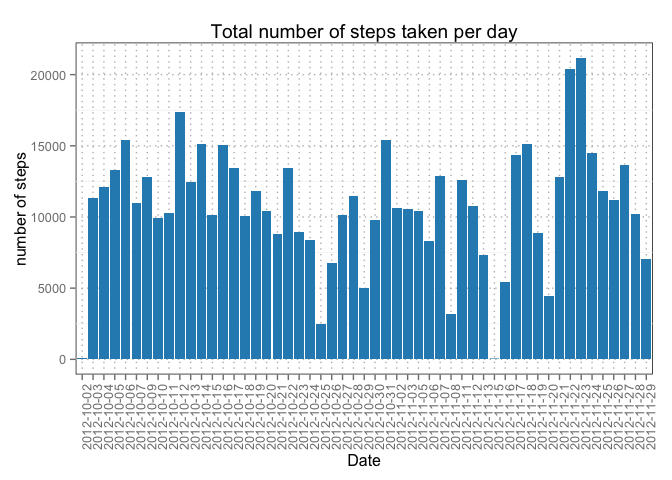
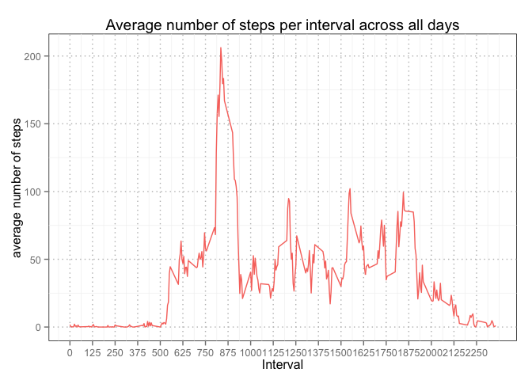
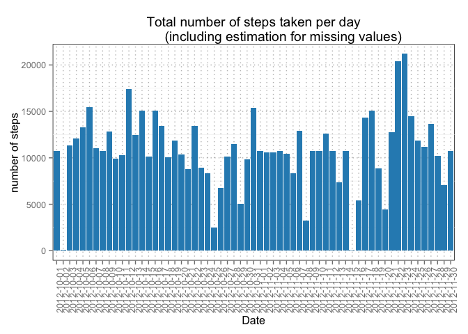
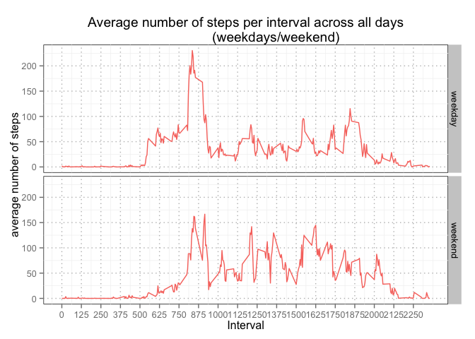

# Reproducible Research: Peer Assessment 1
Franz Eder, University of Innsbruck

Friday, 16 October 2015

## Introduction

It is now possible to collect a large amount of data about personal movement using 
activity monitoring devices such as a Fitbit, Nike Fuelband, or Jawbone Up. These 
type of devices are part of the “quantified self” movement – a group of enthusiasts 
who take measurements about themselves regularly to improve their health, to find 
patterns in their behavior, or because they are tech geeks. But these data remain 
under-utilized both because the raw data are hard to obtain and there is a lack of
statistical methods and software for processing and interpreting the data.

This assignment makes use of data from a personal activity monitoring device. This
device collects data at 5 minute intervals through out the day. The data consists
of two months of data from an anonymous individual collected during the months of
October and November, 2012 and include the number of steps taken in 5 minute
intervals each day.

## Data

Dataset: [Activity monitoring data](https://d396qusza40orc.cloudfront.net/repdata%2Fdata%2Factivity.zip) [52K]
The variables included in this dataset are:

* `steps`: Number of steps taking in a 5-minute interval (missing values are coded as `NA`)

* `date`: The date on which the measurement was taken in YYYY-MM-DD format

* `interval`: Identifier for the 5-minute interval in which measurement was taken

The dataset is stored in a comma-separated-value (CSV) file and there are a total of 17,568 observations in this dataset.

## Preparing R

Load three packages for handling the dataset:

* `dplyr`: for manipulating the dataset

* `ggplot2`: for making plots

* `broman`: for rounding results in inline code


```r
require(dplyr)
require(ggplot2)
require(broman)
```

## Loading and preprocessing the data

Assuming the working directory is set to the folder where the csv-file is stored,
the dataset is read to the data.frame `activity`, the class of column `date` is changed
to `as.Date`, and the columns of the dataframe are reordered by date, interval and steps.


```r
activity <- read.csv("activity.csv")
activity$date <- as.Date(activity$date)
activity <- select(activity, date, interval, steps)
str(activity)
```

```
## 'data.frame':	17568 obs. of  3 variables:
##  $ date    : Date, format: "2012-10-01" "2012-10-01" ...
##  $ interval: int  0 5 10 15 20 25 30 35 40 45 ...
##  $ steps   : int  NA NA NA NA NA NA NA NA NA NA ...
```

## What is mean total number of steps taken per day?

I calculated the total number of steps per day and removed all observations
with `NA`.


```r
total.day <- activity %>%
        na.omit() %>%
        group_by(date) %>%
        summarise(total.steps = sum(steps))
head(total.day)
```

```
## Source: local data frame [6 x 2]
## 
##         date total.steps
##       (date)       (int)
## 1 2012-10-02         126
## 2 2012-10-03       11352
## 3 2012-10-04       12116
## 4 2012-10-05       13294
## 5 2012-10-06       15420
## 6 2012-10-07       11015
```

Based on the result (`total.day`) I plotted a histrogram with ``ggplot2`.


```r
ggplot(total.day, aes(x = factor(date), weight = total.steps)) +
        geom_histogram(fill="#2b8cbe") +
        ggtitle("Total number of steps taken per day") +
        # name x and y axis
        xlab("Date") + ylab("number of steps") +
        # change background color and color of grid, remove legend
        theme(panel.background = element_rect(fill = "#FFFFFF", colour="#000000"), 
              panel.grid.major = element_line(colour = "#bdbdbd", linetype = "dotted"),
              axis.text.x = element_text(angle = 90, hjust = 1), 
              legend.position="none")
```

 


```r
mean.day <- mean(total.day$total.steps)
median.day <- median(total.day$total.steps)
```

The mean and the median of the total number of steps taken per day is **10766.189**
and **10765** respectively.

## What is the average daily activity pattern?

As the time series plot clearly shows, most of the steps taken per day fall into
the intervals from 750 to 900.


```r
steps.interval <- activity %>%
        na.omit() %>%
        group_by(interval) %>%
        summarise(mean.steps = mean(steps))

ggplot(steps.interval, aes(x = interval, y = mean.steps)) +
        geom_line(aes(col = "#e41a1c")) +
        # add title
        ggtitle("Average number of steps per interval across all days") +
        # name x and y axis
        xlab("Interval") + ylab("average number of steps") +
        # change breaks of x-axis
        scale_x_continuous(breaks = seq(0, 2355, 125)) +
        # change background color and color of grid, remove legend
        theme(panel.background = element_rect(fill = "#FFFFFF", colour="#000000"), 
              panel.grid.major = element_line(colour = "#bdbdbd", linetype = "dotted"),
              legend.position="none")
```

 


```r
max.interval <- steps.interval$interval[which.max(steps.interval$mean.steps)]
max.steps <- steps.interval$mean.steps[which(steps.interval == max.interval)]
```

The **835^th** interval contains the maximum number of **206.17** 
steps across all days in the dataset.

## Imputing missing values


```r
missing <- sum(is.na(activity$steps))
```

In the dataset, a total number of **2304** values are missing.


```r
activity2 <- activity
for (i in 1:nrow(activity2)){
       if (is.na(activity2$steps[i])){
                df <- subset(steps.interval, interval == activity2$interval[i])
                activity2$steps[i] <- df$mean.steps    
       }
}
head(activity2)
```

```
##         date interval     steps
## 1 2012-10-01        0 1.7169811
## 2 2012-10-01        5 0.3396226
## 3 2012-10-01       10 0.1320755
## 4 2012-10-01       15 0.1509434
## 5 2012-10-01       20 0.0754717
## 6 2012-10-01       25 2.0943396
```

I saved the original `activity` data.frame to `activity2` and wrote a for loop,
checking every row for missing values and filling those missing values with the
mean value of the corresponding interval.


```r
total.day2 <- activity2 %>%
        group_by(date) %>%
        summarise(total.steps = sum(steps))

ggplot(total.day2, aes(x = factor(date), weight = total.steps)) +
        geom_histogram(fill="#2b8cbe") +
        ggtitle("Total number of steps taken per day
                (including estimation for missing values)") +
        # name x and y axis
        xlab("Date") + ylab("number of steps") +
        # change background color and color of grid, remove legend
        theme(panel.background = element_rect(fill = "#FFFFFF", colour="#000000"), 
              panel.grid.major = element_line(colour = "#bdbdbd", linetype = "dotted"),
              axis.text.x = element_text(angle = 90, hjust = 1), 
              legend.position="none")
```

 

```r
mean.day2 <- mean(total.day2$total.steps)
median.day2 <- mean(total.day2$total.steps)
```

As the histrogram of the `activity2` dataset shows, the missing values do not 
change the overall picture dramatically. The mean remains constant (**10766.19**),
whereas the median ajusts to the mean (**10766.19**).

## Are there differences in activity patterns between weekdays and weekends?


```r
activity.days <- activity2
activity.days$wdwe <- NA
for (i in 1:nrow(activity.days)){
        day <- weekdays(activity.days$date[i])
        if(day %in% c("Samstag", "Sonntag")){
                activity.days$wdwe[i] <- "weekend"}
        else
                {activity.days$wdwe[i] <- "weekday"}
}
activity.days$wdwe <- as.factor(activity.days$wdwe)
head(activity.days)
```

```
##         date interval     steps    wdwe
## 1 2012-10-01        0 1.7169811 weekday
## 2 2012-10-01        5 0.3396226 weekday
## 3 2012-10-01       10 0.1320755 weekday
## 4 2012-10-01       15 0.1509434 weekday
## 5 2012-10-01       20 0.0754717 weekday
## 6 2012-10-01       25 2.0943396 weekday
```

To show the differences of activity patterns between `weekdays` and `weekends` I
used the `activity2` data.frame (the one with the estimation of missing values)
and added a new factor variable (`weekday` and `weekends`).


```r
steps.interval2 <- activity.days %>%
        group_by(interval, wdwe) %>%
        summarise(mean.steps = mean(steps))

ggplot(steps.interval2, aes(x = interval, y = mean.steps)) +
        geom_line(aes(col = "#e41a1c")) +
        # two panels
        facet_grid(wdwe ~ .) +
        # add title
        ggtitle("Average number of steps per interval across all days
                (weekdays/weekend)") +
        # name x and y axis
        xlab("Interval") + ylab("average number of steps") +
        # change breaks of x-axis
        scale_x_continuous(breaks = seq(0, 2355, 125)) +
        # change background color and color of grid, remove legend
        theme(panel.background = element_rect(fill = "#FFFFFF", colour="#000000"), 
              panel.grid.major = element_line(colour = "#bdbdbd", linetype = "dotted"),
              legend.position="none")
```

 

As the panel plot shows, there is a difference between activity patterns between
`weekdays` and `weekends`. People seem to get up earlier on `weekdays` (they have
to go to work) but stay up longer on `weekends` (because they do not have to get
up as early on the next day). Furthermore, they seem to be more active on `weekends`.
